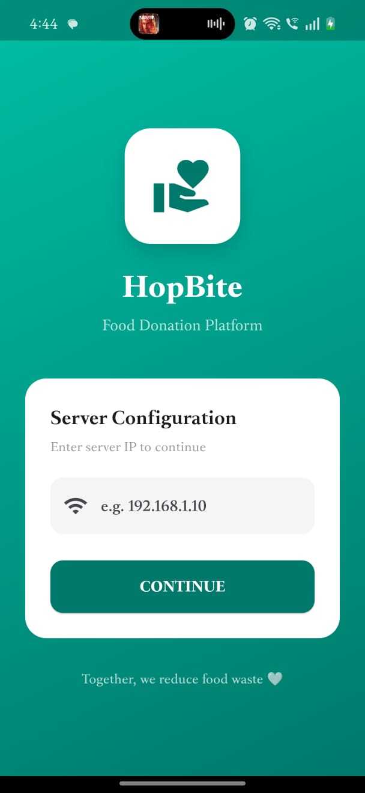
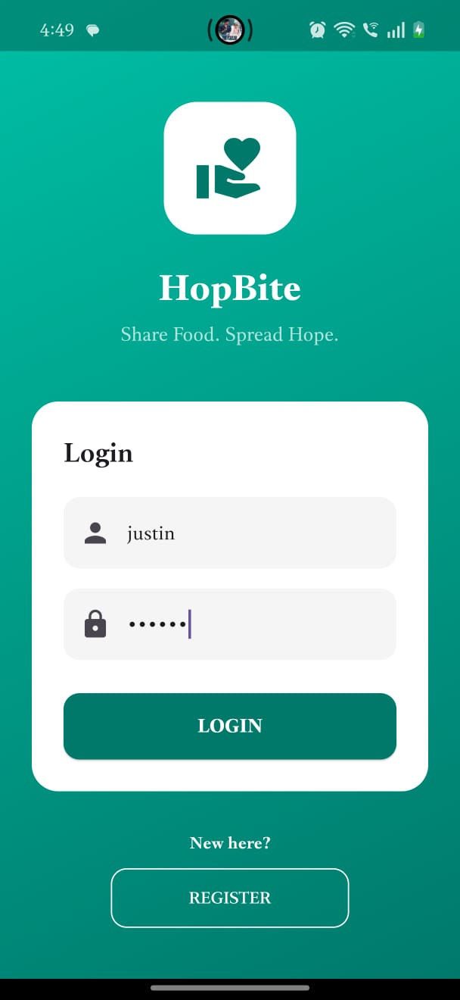
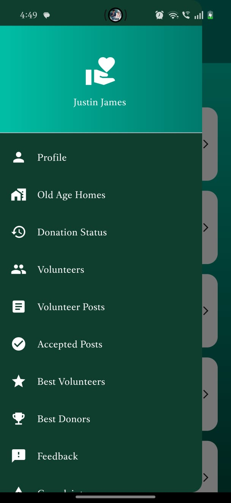
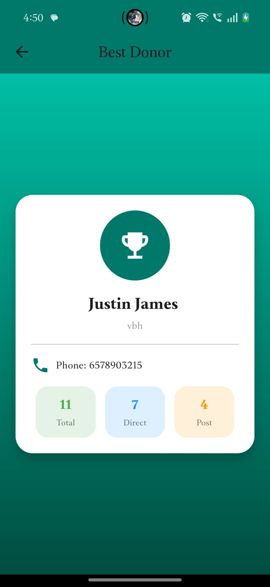
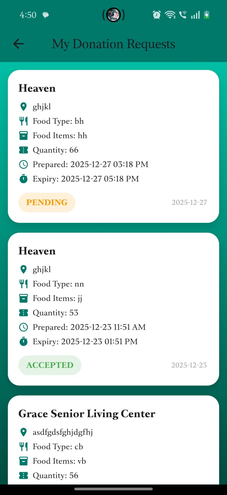

 
# 📱 HopeBite — Food Donation Android App

HopeBite Android is a Flutter-based mobile application connected to the HopeBite Django backend. It allows Donors and Volunteers to manage food donations, track requests, and view AI-powered insights on the go.

---

## 📸 Screenshots

| | |
|---|---|
| **🚀 Server Configuration** | **🔐 Login Page** |
|  |  |
| **🏠 Home Dashboard** | **🏆 Best Donor** |
|  |  |
| **📋 My Donation Requests** | |
|  | |

---

## 🚀 Features

### 🍱 Donor / User
- Server IP Configuration to connect to Django backend
- Register & Login
- Send donation-ready requests to Old Age Homes
- Add food details with AI-assisted expiry prediction (Gemini AI)
- View donation request status (Pending / Accepted / Rejected)
- Accept / Reject volunteer pickup requests
- Add reviews for volunteers
- View Best Volunteer & Best Donor

### 👷 Volunteer
- Register & Login (after admin approval)
- Post public food collection requests
- View and accept donor requests
- Collect food & update pickup status
- Deliver food to Old Age Homes & update delivery status
- View donor and old age home locations on map
- View reviews & ratings
- Send feedback & complaints

---

## 🤖 AI / ML Features

- ⏰ **AI Food Expiry Prediction** — Gemini AI predicts food expiry based on prepared time and food type
- 🏆 **Best Donor Tracking** — Ranked by total number of donations
- 🧠 **Best Volunteer** — ML-based review mining from ratings and activity

---

## 🛠️ Tech Stack

| Layer | Technology |
|-------|-----------|
| Framework | Flutter |
| Language | Dart |
| Backend | Django REST API |
| AI | Gemini AI |
| Platform | Android |

---

## ⚙️ How to Run Locally

### Prerequisites
- Flutter SDK
- Android Studio
- Django backend running locally

### Steps

**1. Clone the repository**

git clone https://github.com/justin-0/hopebite-android.git
cd hopebite-android

**2. Install dependencies**

flutter pub get

**3. Run the app**

flutter run

**4. Enter server IP**

When app opens → enter your local IP address to connect to Django backend

---

## 🌐 Backend Repository

The Django web backend repository is available here:
👉 [hopebite-web](https://github.com/justin-0/hopebite-web)

---

## 👨‍💻 Developer

**Justin**
- 🎓 BCA Graduate
- 💼 1 Year Experience as Junior Software Developer

---

## 📄 License

This project is for educational purposes.